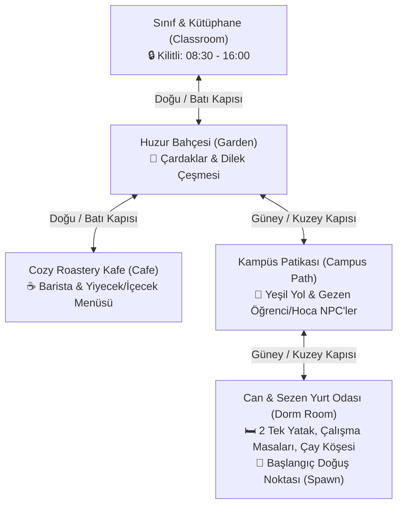

# CozyStudy 3.0: Mega Feature Expansion Specification (BMad Method)

## Executive Summary
This document specifies the architecture and implementation roadmap for CozyStudy 3.0, expanding the Can & Sezen cooperative study universe into a comprehensive Stardew Valley x Good Coffee campus experience.

---

## 1. World Topology & Room Hierarchy

---

## 2. Core Feature Specifications

### 2.1. Feature 1: Time System, Day/Night Cycle & Classroom Schedule Lock
- **Clock Engine**: Top HUD displays a live analog/digital clock (format `HH:MM`).
- **Lighting Shader**: Dynamic atmospheric overlay smoothly transitions across:
  - 06:00 - 08:30: Golden dawn rays
  - 08:30 - 16:00: Bright daytime sunlight
  - 16:00 - 19:30: Warm amber sunset
  - 19:30 - 06:00: Deep starry night indigo
- **Classroom Lock Rule**:
  - Between **08:30** and **16:00**, classroom access is locked due to active lectures.
  - Door collision shows prompt: `🔒 Sınıfta şu an ders işleniyor! (16:00'da açılır)`.
  - Outside these hours (16:00 - 08:30), door unlocks for after-hours study.

### 2.2. Feature 2: Dormitory Room (Yurt Odası) & Spawn Point
- **Spawn Coordinates**:
  - `Can`: (x: 200, y: 220) at Can's bed/desk area.
  - `Sezen`: (x: 440, y: 220) at Sezen's bed/desk area.
- **Authentic Dorm Elements**:
  - 2 Single Beds with custom patterned quilts (Green forest for Can, Lavender for Sezen).
  - Individual study desks with laptops, warm gooseneck study lamps, books.
  - Kitchenette & Tea Corner: Electric kettle with steaming vapor, tea cups, mini-fridge.
  - Wardrobes, cozy dorm rug, laundry hamper, wall corkboard with Polaroid snapshots.
  - North door leading out to the Campus Pathway.

### 2.3. Feature 3: Campus Green Pathway (Ağaçlı Kampüs Yolu)
- **Visuals**: Winding cobblestone trail flanked by lush grass, blooming oak/cherry trees, wooden benches, street lamps.
- **Ambient Life**:
  - Gezen & Sohbet Eden Öğrenci NPC'ler (Ayşe, Kerem).
  - Prof. Hikmet campus stroll animation.
  - Fluttering butterflies and seasonal leaves.

### 2.4. Feature 4: Dynamic Weather Cycle & Audio Ambience
- **Weather States**:
  - `sunny`: Golden sunlight, falling blossom petals, cheerful bird chirps & soft breeze.
  - `rainy`: Gentle or heavy rain drops and ripples, rain sound on ground and leaves.
  - `cloudy`: Soft overcast lighting, mild wind whisper.
  - `night_clear`: Deep blue tones, twinkling fireflies, soothing crickets and night air.
- Weather state synchronized via Socket.IO from server to all connected clients.

### 2.5. Feature 5: Cafe Food & Beverage Purchasing, Hand-Holding & Table Placement
- **Menu Items**:
  - Caramel Macchiato (`item_caramel_latte`)
  - Pour Over V60 Drip (`item_pour_over`)
  - Çikolatalı Sıcak Kurabiye (`item_cookie`)
  - Fransız Kruvasan (`item_croissant`)
  - Papatya Çayı (`item_chamomile_tea`)
- **Holding Mechanics**:
  - Upon ordering, the item appears in the player's hands (`heldItem`).
  - Active 5-minute countdown (300 seconds) shown in HUD.
  - Walking displays the food/drink held in hands.
  - When sitting at any desk/table, the item immediately sits gracefully on the table surface in front of the character!
  - At 0 seconds, player plays a satisfying consumption animation, item vanishes, and a cozy message displays.

---

## 3. The 10 Additional Cozy Features

1. **Jukebox & Lofi Radio Station**: Interactive retro radio in Dorm & Cafe. Toggle between 4 lofi streams (Rainy Study, Acoustic Sunset, Night Farm, Campus Chirp).
2. **Interactive Wishing Fountain (Dilek Çeşmesi)**: Throwing a shiny coin into the garden fountain plays splash sound, grants a motivational fortune note and 1 bonus Cozy Heart.
3. **Cozy Gifting & Inventory**: Pocket pouch allowing Can and Sezen to pick flowers and surprise each other with sweet gifts and custom messages.
4. **Pamuk the Cat Feeding & Follower System**: Buy milk or tuna treat from cafe to feed Pamuk. Pamuk purrs, rubs against legs, and follows the player across rooms for 60 seconds!
5. **Joint Study Analytics & Milestones Board**: Interactive chart in dorm/classroom displaying weekly streaks, total joint hours, and unlockable relationship milestones.
6. **Interactive Dorm Beds & Rest/Sleep Mode**: Press [E] on your bed to lie down under cozy blankets with 'Zzz' particles. If both rest together, triggers a 'Well-Rested Mind' focus aura.
7. **Subject Textbook Selection & Desk Decoration**: Pick your field of study (Medicine, Coding, Law, Literature) at the bookshelf to dynamically load matching books, highlighters, and sticky notes onto your desk.
8. **Polaroid Memory Camera & Photo Album**: [P] key takes an in-game snapshot with a retro paper frame and stamps it into the shared memory book.
9. **Garden Flowerbed Planting & Watering**: Water seedlings by the garden gazebo with a watering can; watch them sprout and bloom into colorful roses after study sessions.
10. **Break Time Mini-Game: Cozy Memory Match**: A cute 1-minute pair-matching game during study breaks to rest the eyes and earn bonus decorative tokens.

---

## 4. Implementation Phasing
- **Phase 1**: Map expansions (`maps.js`) -> Add `dorm` and `campus_path`, connect all 5 rooms.
- **Phase 2**: Sprite & Tile expansions (`sprites.js`) -> Beds, wardrobes, kitchenette, campus trees, held items, food sprites.
- **Phase 3**: Server logic (`server.js`) -> Spawn room to `dorm`, clock sync, weather generator, held item state, schedule locker.
- **Phase 4**: Client Game Engine (`game.js`) -> Dynamic weather rendering, held items rendering in hand & on table, clock HUD, schedule door block.
- **Phase 5**: Audio Engine (`audio.js`) -> Dynamic weather ambience, night crickets, bird songs, radio tracks.
- **Phase 6**: UI & Modals (`ui.js`, `index.html`, `style.css`) -> Food order menu, jukebox player, photo album, dorm bed prompts.
- **Phase 7**: End-to-end verification, syntax check, live build & deployment.
