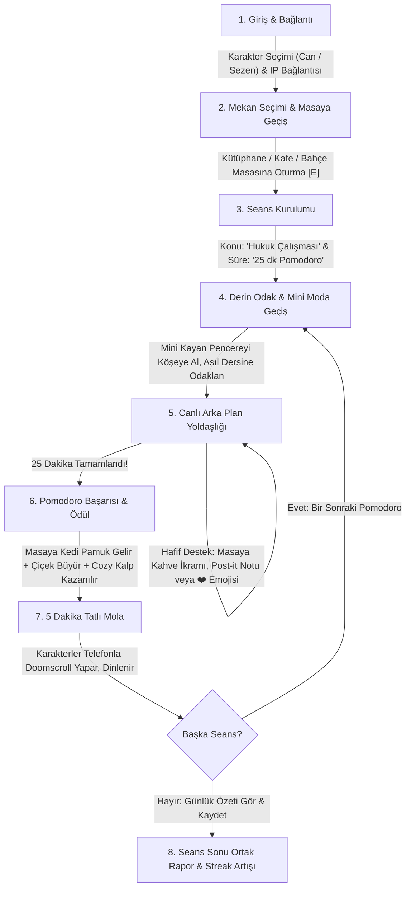

# CozyStudy — BMad Master Analiz: Hedeflenen Vizyon vs. Mevcut Durum & Genel Oyun Mantığı

**Tarih:** 2026-10-01  
**Girişim:** `cozystudy-core-loop-and-vision-alignment`  
**Metodoloji:** BMad Method (Analyst, PM, UX, Architect, Dev Ekipleri)  
**Kapsam:** Sohbetin 1. Gününden İtibaren Tüm Yolculuğun Analizi, Vizyon-Gerçeklik Karşılaştırması ve Nihai Oyun Akışı  

---

## 🧭 1. Sohbetin Başından Bugüne Büyük Resim: "CozyStudy Neydi, Ne Olmalıydı?"

Sohbetin ilk mesajından (Adım 96-116, 265, 837, 1290) bugüne kadar kullanıcının ifade ettiği temel istekler tek bir çekirdek felsefeye dayanıyor:

> **"Bu oyunun en önemli noktası kolay ulaşılabilirliği ve uygulanabilirliği olmalı. Amaç zaten ders çalışırken ufak bir atmosfer versin diye oyunu bir köşeye açmak, full ekran oyuna odaklanmak değil... Küçültülmüş halinde de masada kiminle oturduğunu gör, kaç dakikadır hangi konuyu çalışıyorsun onu gör, karşı tarafın da görebileceği emojileri yolla..."** *(Adım 1290)*

### 🎯 CozyStudy'nin Varoluş Amacı (Value Proposition)
1. **İki Kişilik (Can & Sezen) Samimi Bir Çalışma Alanı:** Can (hafif esmer tenli, koyu saçlı) ve Sezen (beyaz tenli, mavi-siyah ışıltılı saçlı), farklı bilgisayarlarda veya farklı şehirlerde olsalar bile tek tıkla ağ üzerinden (`npm run share` / LAN) aynı sanal masaya oturup birlikte ders çalışabilmeli.
2. **Pasif / Yoldaş Oyun (Companion / Idle-Ambient Game):** Bu bir MMORPG veya sürekli tuşlara basılan bir aksiyon oyunu değildir. Bilgisayarda asıl iş (PDF okuma, kod yazma, tez hazırlama, soru çözme) yapılırken ekranın bir köşesinde (özellikle bağımsız kayan pencerede) sessizce yaşayan, dikkat dağıtmayan ama **"Yalnız değilim, sevgilim hemen karşımda benimle birlikte emek veriyor"** hissini yaşatan sıcacık bir refakatçidir.
3. **Stardew Valley + Good Coffee Great Coffee Ruhunda Piksel Estetiği:** Çiğ AI slop'u veya parlak modern vektör çizimler yerine; sıcak lamba ışıkları, pencereden süzülen yağmur damlaları, kahveden tüten buhar, kitap sayfalarının çevrilmesi ve nostaljik 16-bit piksel detaylar.

---

## ⚖️ 2. Vizyon vs. Mevcut Durum: Derin Karşılaştırma (Gap Analysis)

| Karşılaştırma Boyutu | Hedeflenen Oyun Vizyonu (The Dream) | Şu Anki Mevcut Durum (Current Reality) | Teşhis & Kök Neden (Root Cause) |
|---|---|---|---|
| **1. Oyunun Mantığı ve Kullanım Amacı** | Oyuncular 1-2 tıkla masaya oturur, pencereyi köşeye küçültür ve saatlerce arka planda açık bırakıp gerçek dersine odaklanır. | Oyunda haritalar, çarpışmalar, NPC'ler ve karmaşık menüler var ancak "çalışma oturumu" başlatıp köşeye çekilme hissi henüz pürüzsüz bir ürün gibi hissettirmiyor. | Geliştirme sürecinde "küçük teknik hataları düzeltme" (kolonlar, z-index, buton CSS'leri) ana amacın (seamless study companion) önüne geçti. |
| **2. Çift Dinamiği & Etkileşim** | Can ve Sezen birbirinin varlığını hisseder: Masaya post-it notu bırakma, kahve uzatma, ortak Pomodoro tamamlama, birbirine sessizce sarılma/kalp atma. | İki karakter aynı masaya oturabiliyor ve emoji atabiliyor. Ancak masada derin bir çift bağı veya ortak hedef hissi zayıf. | Etkileşimler genel oyuncu mekaniği gibi tasarlandı; çiftlere özel "ortak çalışma serisi (streak)", "ortak kütüphane" ve "sevgi notları" arka planda kaldı. |
| **3. Pomodoro & Odaklanma Döngüsü** | 25 dk odaklanma -> Masada ders çalışma detayları (kalem sesi, sayfa çevirme, lamba ışığı) -> 5 dk mola -> Karakter doomscroll telefonuna bakar, rahatlar. | Sayaç ve mola mekanikleri kodlandı, mikro-animasyonlar eklendi. Ancak mola bittiğinde ya da Pomodoro tamamlandığında net bir döngü geçişi/kutlama alarmı yok. | Timer yalnızca bir saniye sayacı olarak çalışıyor; oyuncunun psikolojisini yöneten bir "seans akışı" (Session Flow) eksik. |
| **4. Kayan Mini Pencere (Desktop Companion)** | Ekranın köşesinde minimal, transparan/ahşap çerçeveli, asla donmayan, tek tıkla mola verilen ve partnerini canlı gösteren mükemmel bir widget. | `mini.html` ana ekranı tuvalden kesip yansıtıyor. Çalışıyor ancak bağımsız bir masaüstü widget'ı gibi değil, küçültülmüş bir web iframe'i gibi hissettiriyor. | Pencere ergonomisi ve kontrolleri daha rafine, tek bakışta anlaşılır bir kompakt arayüze kavuşturulmalı. |
| **5. Oyunlaştırma & Kalıcılık (Progression)** | Birlikte çalışılan her 1 saat masayı ve odayı güzelleştirir: Sukulent çiçeği açar, kedi Pamuk masanın kenarına gelip uyur, kahve çekirdekleriyle yeni kasetler açılır. | `data/progress.json` dosyasında dakika ve kalp kaydı var, ancak oyuncu masadayken bu ilerlemenin görsel meyvesini canlı olarak göremiyor. | Veritabanı/JSON kaydı yapıldı ama UI ve sahneye "canlı ödül geri bildirimi" bağlanmadı. |
| **6. Sanat & Tutarlılık** | Karakterler Can ve Sezen'e birebir uyan, yazısız, aynı açıda (3/4 portre) Stardew Valley pikselleriyle temsil edilir. Mekanlar ruh doludur. | Can esmer ve yana bakıyor; Sezen'in geçici portresi düz bakıyor; mekan banner'ları geçici. Kota sıfırlanması bekleniyor. | Saat 14:42 TSİ kotası nedeniyle görsel güncellemesi ertelendi (Planlı bekleme). |

---

## 🔄 3. Oyunun Genel Mantığı ve İdeal Yaşam Döngüsü (Master Game Loop)

Bir oyuncunun (örneğin Can veya Sezen) bilgisayarını açtığı andan 3 saatlik bir çalışma seansını tamamladığı ana kadar yaşayacağı **ideal akış**:

---

## 👥 4. BMad Ekip Rollerinin Stratejik Değerlendirmesi

### 📊 Mary (Business & User Analyst): "Vizyon Neden Dağıldı?"
> *"Kullanıcının ilk günden beri istediği şey karmaşık bir oyun değil, sevgilisiyle ders çalışırken arkada açacağı bir atmosfer penceresiydi. Ancak geliştirici refleksleri projeyi 'WASD ile yürüyen standart bir piksel RPG' kalıbına soktu. RPG öğeleri (harita yürüyüşü, kapılar, çarpışmalar) bir araçtır, amaç değildir. Asıl değer teklifi: **Sıfır eforla masaya oturup yan yana ders çalışabilmek ve bunu sevimli bir rutin haline getirmek.** Bütün geliştirmeler bu amaca hizmet etmeli."*

### 📋 John (Product Manager): "Oyunun Omurgasını Yeniden İnşa Etme Planı"
> *"Oyunun omurgasını 3 temel sütun üzerinde yeniden kurgulamalıyız:*
> 1. **Zero-Friction Başlangıç:** Oyuna girildiği anda tek tıkla partnerinin masasına ışınlanma veya yanına oturma seçeneği.
> 2. **Meaningful Presence (Anlamlı Birliktelik):** İki kişi aynı masadayken oyun bunu kutlamalı (senkronize sayaç, ortak kalp parıltısı, masaya özel küçük jestler).
> 3. **The Ambient Mini Widget:** Mini pencere ikinci sınıf bir yan özellik değil, CozyStudy'nin **asıl vitrini** olmalıdır. Kullanıcı çalışma süresinin %90'ını bu mini pencereyle geçirecektir."*

### 🎨 Sally (UX & Game Designer): "Masaüstünde Yaşayan Sıcaklık"
> *"Görsel ve işitsel tasarımda şu 3 ilkeyi koruyacağız:*
> 1. **Gözü Yormayan Palet:** Sıcak kehribar, adaçayı yeşili, kahve tonları ve gece kütüphanesi ışığı.
> 2. **Sessiz İletişim:** Ders çalışan insan konuşarak dikkatini dağıtmaz. Masanın ucuna iliştirilen renkli bir post-it notu, masaya bırakılan sıcak bir fincan veya tek tıkla gönderilen uçuşan bir kalp, derin odaklanmayı bozmadan sevgi hissettirir.
> 3. **Mola Kontrastı:** Ders çalışırken ciddiyet ve huzur (kitap, buhar, kalem), mola verildiğinde ise tatlı bir gevşeme (elinde telefonla parmağını kaydıran karakter, mavi ekran ışığı)."*

### 🏗️ Winston (System Architect): "Teknik Dayanıklılık & Basitlik"
> *"1. `progress.json` üzerindeki veriyi oyun arayüzüyle iki yönlü reaktif hale getireceğiz. Kazanılan her kalp ve tamamlanan her seans anında yerel ve karşı istemciye yansıyacak.
> 2. `mini.html` ile `main.html` arasındaki bağlantıyı daha sağlam bir BroadcastChannel / postMessage katmanına kavuşturarak tek tıkla odak başlatma/durdurma işlevlerini sıfır gecikmeli hale getireceğiz.
> 3. Saat 14:42 TSİ görsel güncellemesi için varlık altyapısı hazır; onay geldikten sonra tek satır kod kırmadan yerlerine oturacak."*

### 💻 Amelia (Lead Developer): "Uygulama Prensipleri"
> *"Mevcut çalışan hiçbir mekanizmayı (socket yapısı, render loop, optimistik timer, ses katmanları) bozmadan, sadece bu büyük vizyonu tamamlayan katmanları sırasıyla inşa edeceğiz."*

---

## 🗺️ 5. Büyük Resmi Gerçeğe Dönüştüren Nihai Stratejik Plan (Master Execution Plan)

### Adım 1: "Çiftin Masası" Odaklı Oyun Döngüsü (The Couple's Study Core)
- **Tek Tıkla Sevgilinin Yanına Oturma:** Can oyuna girdiğinde eğer Sezen bir masada oturuyorsa, ekranda *"Sezen Kütüphane 2. Masada çalışıyor -> [Yanına Işınlan & Otur]"* kısayolu.
- **Senkronize Pomodoro Modu:** Biri mola verdiğinde diğerine zarif bir bildirim: *"Sezen molaya çıktı ☕"* veya birlikte aynı anda 25 dakikalık Pomodoro başlatabilme opsiyonu.
- **Masada Canlı Post-It Notu:** Masanın kenarında küçük renkli bir not kağıdı. Can veya Sezen tıkladığında partnerine tatlı bir motivasyon notu yazar (*"Kolay gelsin sevgilim, çok az kaldı ❤️"*). Not masada parıldar; karşı taraf tıklayınca nostaljik el yazısı fontuyla açılır.
- **Kahve/Çay İkramı:** Masadaki partnerine fincana tıklayarak sıcak kahve uzatma jesti (fincandan kalpler yükselir, sevimli 'clink' fincan sesi çalar).

### Adım 2: Mini Companion'ın Gerçek Bir Masaüstü Widget'ına Dönüştürülmesi
- Mini pencere (`mini.html`), gereksiz tüm kenarlıklardan arındırılmış, şık bir ahşap/lofi çerçeveye oturtulacak.
- Üzerinde:
  - Masada oturan Can ve Sezen'in canlı animasyonu (kitap okuyan, kahvesi tüten halleri).
  - Canlı sayaç ve konu başlığı.
  - Hızlı reaksiyon butonları (☕ Kahve ısmarla, 📝 Not bırak, ❤️ Sevgi gönder, ⏸️ Mola).
- Arka planda çalışırken sıfır CPU tüketimi ve pürüzsüz akış.

### Adım 3: Birlikte İlerleme, Rutin ve Ödül Sistemi (Cozy Progression)
- **Günlük Çalışma Panosu:** Mekanların girişinde yer alan ahşap duyuru panosu:
  - *"Can & Sezen Birlikte: 14 Saat 20 Dk Çalıştı • 5 Günlük Seri 🔥"*
- **Masa Güzelleştirme & Ziyaretçiler:**
  - 1 Pomodoro tamamlanınca: Masaya küçük bir sukulent çiçeği eklenir.
  - 2 Pomodoro tamamlanınca: Kedi Pamuk gelip masanın ucuna kıvrılır ve mırıldanır (`purr`).
  - Kazanılan Cozy Kalpler ile yeni fincan modelleri, masa örtüleri ve lofi müzik kasetleri açılır.

### Adım 4: Saat 14:42 TSİ Sanat & Görsel Tamamlama
- Saat 14:42'de kota açıldığında:
  - Sezen için Can'a bakan 3/4 açılı, mavi-siyah saçlı, beyaz tenli, Stardew Valley piksel portresi üretilip onayına sunulacak.
  - Kütüphane, Kafe, Bahçe ve Giriş için retro piksel mekan banner'ları üretilip onayına sunulacak.
  - Kullanıcı onay verince `public/assets/` klasörüne aktarılacak.
